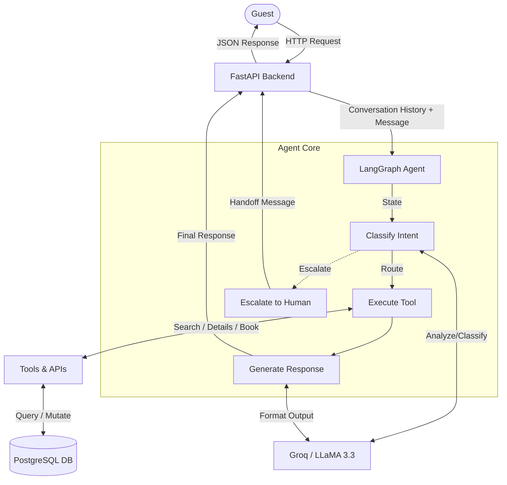

# StayEase AI Agent Architecture

## 1.1 System Overview
StayEase AI Agent is an intelligent conversational assistant designed for a short-term accommodation rental platform in Bangladesh. It handles three core functionalities: searching for available properties based on user criteria, providing detailed information about specific listings, and facilitating the booking process. The system uses a FastAPI backend to handle HTTP requests, a LangGraph-based intelligent agent for stateful conversation management, a PostgreSQL database for persistent storage, and Groq's fast LLM API for natural language understanding and intent classification.



## 1.2 Conversation Flow

**Example Scenario:** A guest says *"I need a room in Cox's Bazar for 2 nights for 2 guests"*

1. **User Request**: The user sends the message to the FastAPI endpoint (`POST /api/chat/{conversation_id}/message`).
2. **State Initialization**: The FastAPI backend retrieves the conversation history from PostgreSQL and initializes the LangGraph state.
3. **Intent Classification**: The `classify_intent` node receives the state and calls the LLM. The LLM identifies the intent as `"search"` and extracts the parameters (`location`: "Cox's Bazar", `guests`: 2, etc.).
4. **Routing**: The graph's conditional edge checks the intent. Since it is `"search"`, it routes to the `execute_tool` node.
5. **Tool Execution**: The `execute_tool` node invokes the `search_available_properties` tool with the extracted parameters.
6. **Database Query**: The tool queries the PostgreSQL `listings` table for properties in Cox's Bazar accommodating at least 2 guests.
7. **Generate Response**: The tool returns a list of properties. The `generate_response` node takes this raw data and uses the LLM to format a friendly, natural language reply.
8. **Final Output**: The generated response is returned to the FastAPI backend, which sends it back to the user and updates the conversation history in the database.

## 1.3 LangGraph State Design

```python
class AgentState(TypedDict):
    messages: Annotated[list[BaseMessage], add_messages] # Stores the conversation history and intermediate tool messages.
    intent: str # Categorizes user intent ("search", "details", "book", "escalate") for routing.
    tool_input: dict # Holds the extracted parameters needed to execute a specific tool.
    tool_output: dict | None # Temporarily stores the raw data returned by a tool before formatting.
    conversation_id: str # Unique identifier for the conversation session to track context.
```

## 1.4 Node Design

1. **`classify_intent`**
   - **What it does**: Analyzes the latest user message to determine their goal and extracts any necessary parameters.
   - **What it updates in state**: `intent`, `tool_input`
   - **What node comes next**: Conditional routing -> `execute_tool` OR `escalate`
2. **`execute_tool`**
   - **What it does**: Calls the specific Python tool function mapped to the user's intent.
   - **What it updates in state**: `tool_output`
   - **What node comes next**: `generate_response`
3. **`generate_response`**
   - **What it does**: Takes the raw tool output and generates a human-readable, context-aware reply using the LLM.
   - **What it updates in state**: `messages`
   - **What node comes next**: `END`
4. **`escalate`**
   - **What it does**: Generates a standard message informing the user that they are being transferred to a human agent for unsupported requests.
   - **What it updates in state**: `messages`
   - **What node comes next**: `END`

## 1.5 Tool Definitions

### 1. `search_available_properties`
- **When used**: When the user wants to find accommodations based on criteria (location, dates, capacity).
- **Input parameters**:
  - `location` (string): The city or area (e.g., "Cox's Bazar").
  - `check_in` (date): The desired check-in date.
  - `check_out` (date): The desired check-out date.
  - `guests` (integer): Number of people staying.
- **Output format**: List of dicts representing available properties (id, title, price, etc.).

### 2. `get_listing_details`
- **When used**: When the user asks for more information about a specific property (e.g., "Tell me more about the Seaside Villa").
- **Input parameters**:
  - `listing_id` (integer): The unique ID of the property.
- **Output format**: Dict containing detailed property information (description, full amenities, max capacity, price per night).

### 3. `create_booking`
- **When used**: When the user explicitly confirms they want to rent a specific property for specific dates.
- **Input parameters**:
  - `listing_id` (integer): The ID of the property to book.
  - `guest_name` (string): Name of the guest.
  - `check_in` (date): Check-in date.
  - `check_out` (date): Check-out date.
  - `guests` (integer): Number of guests.
- **Output format**: Dict with booking confirmation details (booking ID, total price, status).

## 1.6 Database Schema Design

### `listings` Table
| Column | Data Type | Description |
|--------|-----------|-------------|
| `id` | SERIAL (PK) | Unique ID |
| `title` | VARCHAR(255) | Property name |
| `location` | VARCHAR(100) | City/Area |
| `description` | TEXT | Detailed info |
| `price_per_night`| DECIMAL(10,2) | Cost per night (BDT) |
| `max_guests` | INTEGER | Maximum capacity |
| `amenities` | TEXT[] | Array of amenities (e.g., WiFi, AC) |
| `is_available` | BOOLEAN | Current status |
| `created_at` | TIMESTAMP | Record creation time |

### `bookings` Table
| Column | Data Type | Description |
|--------|-----------|-------------|
| `id` | SERIAL (PK) | Unique booking ID |
| `listing_id` | INTEGER (FK) | References `listings(id)` |
| `guest_name` | VARCHAR(255) | Name of primary guest |
| `check_in` | DATE | Check-in date |
| `check_out` | DATE | Check-out date |
| `guests` | INTEGER | Number of guests for this stay |
| `total_price` | DECIMAL(10,2) | Calculated total cost (BDT) |
| `status` | VARCHAR(20) | 'confirmed', 'cancelled', etc. |
| `created_at` | TIMESTAMP | Booking creation time |

### `conversations` Table
| Column | Data Type | Description |
|--------|-----------|-------------|
| `id` | UUID (PK) | Unique session/chat ID |
| `messages` | JSONB | Serialized chat history |
| `created_at` | TIMESTAMP | Session start time |
| `updated_at` | TIMESTAMP | Last message time |
